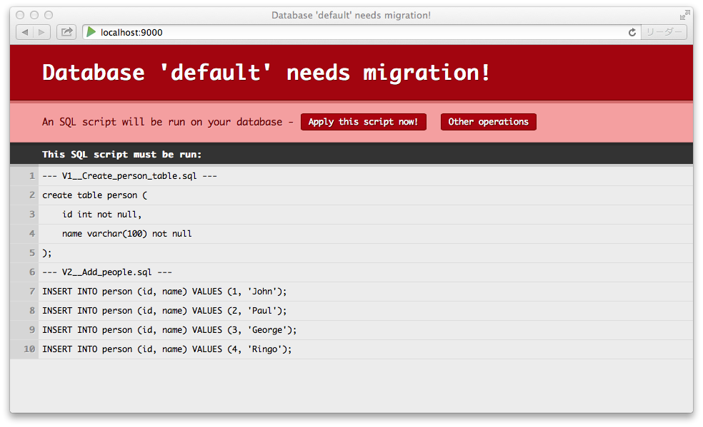
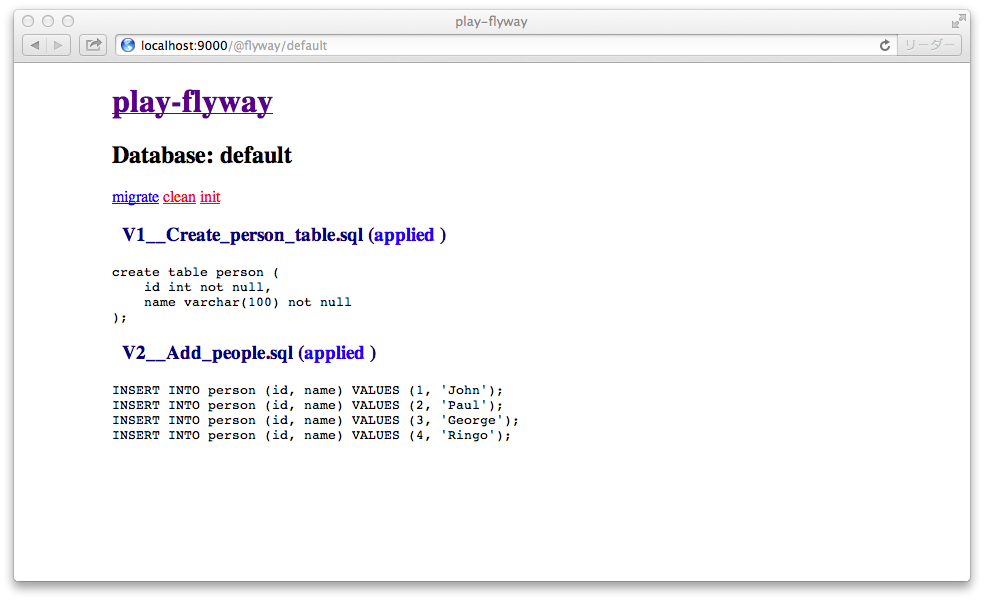

# flyway-play

[](https://travis-ci.org/flyway/flyway-play)

Flyway module for Play 2.4 or later. It aims to be a substitute for play-evolutions.

This module is successor of [tototoshi/play-flyway](https://github.com/tototoshi/play-flyway), which is a Play Plugin supporting Play 2.1 ~ 2.3.

## <a class="anchor" name="features"></a>Features

 - Based on [Flyway](http://flywaydb.org/)
 - No 'Downs' part.
 - Independent of DBPlugin(play.api.db).

## <a class="anchor" name="install"></a>Install

build.sbt

```scala
libraryDependencies ++= Seq(
  "org.flywaydb" %% "flyway-play" % "2.2.0"
)
```

conf/application.conf

```
play.modules.enabled += "org.flywaydb.play.PlayModule"
```


## <a class="anchor" name="getting-started"></a>Getting Started

### Basic configuration

Database settings can be set in manner of Play2.

```
db.default.driver=org.h2.Driver
db.default.url="jdbc:h2:mem:example2;db_CLOSE_DELAY=-1"
db.default.username="sa"
db.default.password="secret"

# optional
db.default.schemas=["public", "other"]
```

### Slick Support

```
slick.dbs.yourAwesomeDbName.driver = "slick.driver.H2Driver$"
slick.dbs.yourAwesomeDbName.db.driver = "org.h2.Driver"
slick.dbs.yourAwesomeDbName.db.url="jdbc:h2:mem:example2;db_CLOSE_DELAY=-1"
slick.dbs.yourAwesomeDbName.db.username="sa"
slick.dbs.yourAwesomeDbName.db.password="secret"
```

One detail here is that you should add any flyway configuration under the path `slick.dbs.yourAwesomeDbName.db` 


### Place migration scripts

A migration script is just a simple SQL file.

```sql
CREATE TABLE FOO (.............


```

# Place your migration scripts 
 
 - For slick put them in the following path `conf/migration/slick/{dbName}`
 - For default play database put them in `conf/migration/db/{dbName}`


```
playapp
├── app
│   ├── controllers
│   ├── models
│   └── views
├── conf
│   ├── application.conf
│   ├── migration
│   │   └── db
│   │   │   ├── default
│   │   │   │   ├── V1__Create_person_table.sql
│   │   │   │   └── V2__Add_people.sql
│   │   │   └── secondary
│   │   │       ├── V1__create_job_table.sql
│   │   │       └── V2__Add_job.sql
│   │   │    
│   │   └── slick    
│   │       ├── default
│   │           ├── V1__Create_person_table.sql
│   │           └── V2__Add_people.sql
│   │    
│   ├── play.plugins
│   └── routes
```


Please see flyway's documents about the naming convention for migration scripts.

http://flywaydb.org/documentation/migration/sql.html

### Placeholders

Flyway can replace placeholders in Sql migrations.
The default pattern is ${placeholder}.
This can be configured using the placeholderPrefix and placeholderSuffix properties.

The placeholder prefix, suffix and key-value pairs can be specificed in application.conf, e.g.

  - For default play database handling: 
    ```
    db.${dbName}.migration.placeholderPrefix="$flyway{{{"
    db.${dbName}.migration.placeholderSuffix="}}}"
    db.${dbName}.migration.placeholders.foo="bar"
    db.${dbName}.migration.placeholders.hoge="pupi"
  ```

  - For slick:
    ```
    slick.dbs.${dbName}.db.migration.placeholderPrefix="$flyway{{{"
    slick.dbs.${dbName}.db.migration.placeholderSuffix="}}}"
    slick.dbs.${dbName}.db.migration.placeholders.foo="bar"
    slick.dbs.${dbName}.db.migration.placeholders.hoge="pupi"
    ```

This would cause

```sql
INSERT INTO USERS ($flyway{{{foo}}}) VALUES ('$flyway{{{hoge}}}')
```

to be rewritten to

```sql
INSERT INTO USERS (bar) VALUES ('pupi')
```

### Enable/disable Validation

From flyway 3.0, `validate` run before `migrate` by default.
Set `validateOnMigrate` to false if you want to disable this.

```
db.${dbName}.migration.validateOnMigrate=false // true by default
```

or for slick

```
slick.dbs.${dbName}.db.migration.validateOnMigrate=false // true by default
```

### Configuring a custom web command URI path
By default, you can apply you flyway migration entering on the uri `/@flyway` on you application.

If you wish you could customize those paths

`flyway.webCommand.baseURI = "my/admin/uri`
`flyway.webCommand.baseName = "migrations"`

and this will end up in a url like this `http://<your-address>/my/admin/uri/migrations/{dbname}/<flyway-command>`


### Dev




For existing schema, Flyway has a option called 'initOnMigrate'. This option is enabled when `-Ddb.${dbName}.migration.initOnMigrate=true`.
For example,
```
$ play -Ddb.default.migration.initOnMigrate=true
```

Of course, You can write this in your `application.conf`.


Manual migration is also supported. Click 'Other operations' or open `/@flyway/${dbName}` directly.




### Test

In Test mode, migration is done automatically.


### Prod

In production mode, migration is done automatically if `db.${dbName}.migration.auto` is set to be true in application.conf.
Otherwise it failed to start when migration is needed.

```
$ play -Ddb.default.migration.auto=true start
```

## <a class="anchor" name="example"></a>Example application

[seratch/devteam-app](https://github.com/seratch/devteam-app "seratch/devteam-app") is using play-flyway. Maybe this is a good example.

## <a class="anchor" name="changelog"></a>Change Log

### 2.3.0

 - Add support to slick migrations and remove hardcoded database config path.
 - Add configurable flyway base uri.

### 2.2.0

 - Removed dependency on play.api.Application

### 2.1.0

 - Support for specifying a list of schemas
 - Fixed classloader issue

### 2.0.1

 - Supported new configuration key, `db.default.username`.

### 2.0.0

 - Play 2.4 support

## <a class="anchor" name="license"></a>License

- Apache 2.0 License
